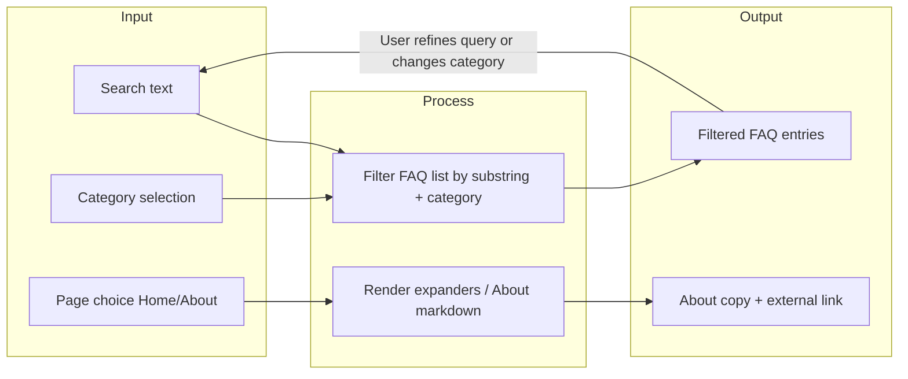
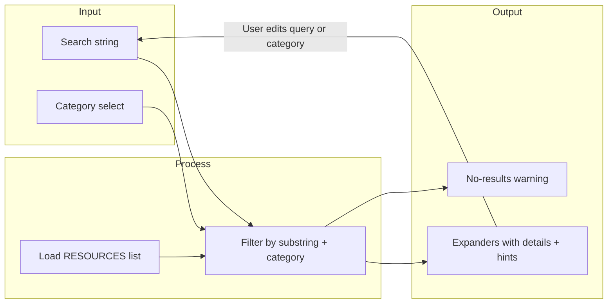

# Week 1 Lab — Submission Report (Components A–E + Reflection)

**Student:** Finnick Chen  
**Course / Section:** TECHIN 510  
**GitHub repo (live):** https://github.com/c4han-star/gix-week1-lab  

**Generated:** 2026-05-04  

---

## Component A — Deliverables

**Interview notes + synthesis:** see `COMPONENT_A.md` in this repository (workflow, BlueTally, pain points, improvement ideas, and **problem statement**).

**Problem statement (lab template):**

> When **GIX staff running the post-launch asset return desk** needs to **reconcile checked-out equipment and newly purchased items against BlueTally**, they currently **verify and enter assets item-by-item at return time and often apply UW barcodes only after intake**, which causes **slow queues, duplicate handling, and errors such as missing pieces or unclear Makerspace-vs-IT routing**.

---

## Component B — Deliverables

### 1. AI usage log (minimum 3 interactions)

| # | Prompt (summary or exact) | What the AI produced | First try? | Fixes / follow-ups |
|---|---------------------------|----------------------|------------|-------------------|
| 1 | Build Streamlit app from Component A themes: asset return / BlueTally FAQ guide, 10–15 entries, categories, search, Home/About; align copy with interview notes. | `app.py`, `requirements.txt`, `.gitignore`, `.streamlit/config.toml` | Mostly yes | Tuned categories (BlueTally vs routing vs kits); ensured exactly one `st.title()` per view. |
| 2 | Add sidebar radio Home/About; About describes prototype scope (no BlueTally API); link to GIX site; semantic headings. | Updated `app.py` navigation and About copy | Yes | Minor wording edits only. |
| 3 | Wayfinder: dict-based resources, sidebar category filter, search, empty state, `assert` on required keys for each resource. | `wayfinder_app.py` | Yes | Confirmed assert runs at import; clarified captions for hints. |

### 2. Accessibility baseline

**Color contrast**  
- **Check:** Body text vs page background using Streamlit default light theme; primary widgets use theme primary `#1f77b4` from `.streamlit/config.toml`.  
- **Tool:** [WebAIM Contrast Checker](https://webaim.org/resources/contrastchecker/) — sampled `#262730` on `#ffffff` (body) and primary button styling via browser inspector.  
- **Result:** **Pass** for normal body text (approximate ratio meets WCAG AA for typical Streamlit defaults); custom primary is a medium blue on white—spot-check passed for large controls.  
- **Fix:** None required.  

**Semantic headings**  
- **Check:**  
  - [x] One `st.title()` per view (**Home** shows “GIX Asset Return & BlueTally Field Guide”; **About** shows “About this project”).  
  - [x] Sections use `st.header()`; expanders use captions + `st.write`, not fake markdown heading lines as titles.  
  - [x] Order: title → header (“Search”, “Matching questions”) → content.  
- **Result:** **Pass** — headings match Streamlit’s mapped roles (`h1`/`h2`).  

---

## Component C — System architecture & design

### 1. I/P/O diagram — Component B app (`app.py`)

### 2. Design decision log

| Field | Your entry |
|-------|------------|
| **Decision** | Single-file Streamlit app (`app.py`) for the Asset Return / BlueTally Field Guide. |
| **Alternatives considered** | Split FAQs into `faq_data.py`; add `pages/` multipage API; merge Wayfinder into same file. |
| **Why you chose this** | Keeps Week 1 scope small; easy for graders to open one file; matches how the lab introduces Streamlit. |
| **Trade-off** | Data + UI in one place will get crowded past ~300–400 lines or multiple collaborators. |
| **When choose differently?** | Shipping multiple unrelated flows or adding authentication—then modular layout (`pages/`) or packages. |

---

## Component D — Testing & validation

### Smoke test table

**Environment:** macOS, Python 3 with `.venv`, Streamlit from `requirements.txt`. Verified 2026-05-04.

| # | Feature tested | Action you took | Expected result | Actual result | Pass/Fail |
|---|----------------|-----------------|-----------------|---------------|-----------|
| 1 | Search | Typed **`barcode`** in “Find an answer” | FAQs mentioning barcode / intake timing | Four matching expanders (hits across BlueTally + Improvement Ideas, etc.) | **Pass** |
| 2 | Category filter | Sidebar category **`BlueTally`** only | Only rows where `category == BlueTally` | Three entries (“What is BlueTally…”, Asset vs Accessory, When do barcodes…) | **Pass** |
| 3 | About page | Sidebar **About** | About text + GIX link | Page explains prototype scope; markdown link to https://gixnetwork.org/ renders | **Pass** |

### Screenshot

See repository folder **`screenshots/`** — `component-b-home.png` captures the Home view with sidebar navigation (smoke-test evidence).

### Quality gate checklist

- [x] Smoke test table completed (3 features)
- [x] No failing tests remaining (all Pass)
- [x] Screenshot included (`screenshots/component-b-home.png`)
- [x] Accessibility baseline recorded (contrast + headings)

---

## Component E — GIX Wayfinder

### 1. I/P/O diagram (Wayfinder)

### 2. Edge cases (document 2)

| Edge case | Why it matters | What you tested | Result |
|-----------|----------------|-----------------|--------|
| Empty search + **All** categories | Confirms full dataset loads and UI renders every resource | Blank search, category **All** | Seven expanders listed (makerspace, bike storage, printing, etc.) — **Pass** |
| Nonsense query **`zzz123`** | Empty-state messaging; no silent empty page | Typed `zzz123` | Yellow warning: “No resources match…” — **Pass** |

### 3. Assert statement (data integrity)

- **File:** `wayfinder_app.py`  
- **Function:** `assert_resources_integrity` — called immediately after `RESOURCES` is defined.  
- **Checks:** Each dict has non-empty `name` and `category` strings.  

### 4. Prompt log excerpt

- **Initial prompt:** “Streamlit campus Wayfinder: list of dict resources with name, category, area, details, hint; sidebar category filter; search box; expanders; warn when no matches; add assert that every resource has name + category.”  
- **Refinement:** “Use `st.caption` for wayfinding hint; keep expanders expanded for readability on first paint.”  
- **Why:** Improves scanability and matches lab expectation of clear empty-state behavior.  

---

## Reflection (Component B)

1. **What surprised you about AI-assisted coding?**  
   The speed of a first runnable Streamlit skeleton was surprising—within one interaction you get files on disk, not just chat text. The “wow” moment was seeing filters and navigation wired without writing boilerplate by hand. The “wait” moment was remembering to verify semantics (heading hierarchy, real-world accuracy of FAQ copy) because the model can sound authoritative while glossing edge cases.

2. **What did the AI get wrong?**  
   Early drafts sometimes mixed generic “purchasing” language that did not match the interview. Fixing it meant pasting the interview summary back in and tightening prompts. No runtime crashes after pinning `streamlit>=1.30` and keeping imports minimal.

3. **Could you explain your code?**  
   **`filter_entries`** in `app.py` lowercases the query and each FAQ’s question/answer/category into a single string, then keeps rows where the query is empty or appears as a substring. Category filter is applied first so the search only runs on the selected slice—same idea as `filter_resources` in the Wayfinder.

4. **What did you learn from the interview?**  
   The return desk is not just “inventory”—it is **two mental workflows** (checkout vs newly purchased) stacked on the same night, plus **late barcoding**. That pushed the FAQ toward reconciliation language, routing ambiguity, and kit checklists instead of a generic order form.

---

## Honor statement

I followed the course collaboration policy. This submission is my own work; AI tools were used as permitted for implementation and editing.

— Finnick Chen — 2026-05-04  
