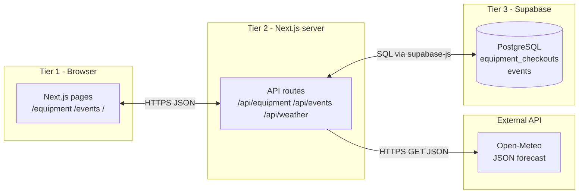

# Architecture diagrams

**Static images (for Canvas / PDF):**

- [images/c2-three-tier.svg](images/c2-three-tier.svg)
- [images/component-e-boundaries.svg](images/component-e-boundaries.svg)

## C.2 — Three-tier (Component B app)

**Arrow labels:** Browser ↔ Server: HTTP/JSON. Server ↔ Supabase: PostgREST/SQL. Server → Open-Meteo: HTTPS JSON forecast.

## Component E — Boundary map (Part 1)

| Boundary | Data format | Potential error |
|----------|-------------|-----------------|
| User → React UI | clicks, form fields | Validation typo / double submit |
| UI → `/api/events` | HTTP GET + query string | Wrong category param → empty list |
| API route → Supabase | SQL select | RLS / network timeout |
| Supabase → API | JSON rows | Schema drift (missing column) |
| API → Browser | JSON `{ rows }` | Serialization / large payload |

Optional: export a PNG from [Mermaid Live](https://mermaid.live) into `docs/images/` for Canvas upload. SVG versions are already in [images/](images/README.md).
